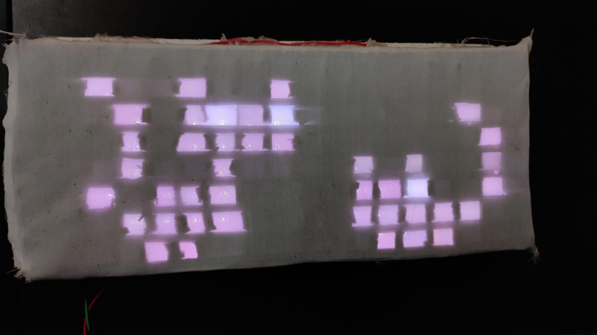

# FastLED 2D Matrix Animation Code Generator
This project allows you to generate code for the FastLED library from gif files that you can create in any program of your choice. 


## How To Use

To get started with this we need a gif file that should ideally be the same resolution as the panel. The code iterates through every pixel of the every frame of the image and assigns that to the corresponding LED on the panel. To understand this, it is important to understand how FastLED library renders color to the LEDs, for which I recommend going through [this](https://github.com/FastLED/FastLED/wiki/Controlling-leds+).

The program is pretty crude at the moment(but the core functionality works), so it needs some initial values to get started. Let's look at them.

```python
# Open image file
im = Image.open('image.gif')

#variable to hold frame rate/speed of animation
delay = 350

#number of LEDs in panel
NUM_LEDS = 128
```

Firstly, we need a GIF file to work with. Like mentioned above, it should ideally be the same resolution as the frame. The code has measures in place to check for that though but still.


</div>

It is important to understand and compare the layout of the panel and the GIF. The panel should ideally have the first LED on the top left corner. If not, necessary modifications must be made to accomodate the changes. 

NOTE: Currently there is a dependency on the calibrate() that is implemented on the Arduino end. The plan is to include that functionality within this code itself. 

Once the code runs, we should be left with a text file that looks something like

```cpp
leds[0] = CRGB(255, 255, 255);
leds[1] = CRGB(255, 255, 255);
...
...
leds[n] = CRGB(255, 255, 255);
calibrate();
FastLED.show();
delay(400);

leds[0] = CRGB(255, 255, 255);
leds[1] = CRGB(255, 255, 255);
...
...
leds[n] = CRGB(255, 255, 255);
calibrate();
FastLED.show();
delay(400);
```

This snippet can then copy pasted in the Arduino code and it should run automatically. Here, every block separated by a delay() is a different frame. If everything works correctly, you should have the same animation running on the panel like this. 

<div align=center>

</div>

That's it so far.

## Future Plans
* Include an UI wrapper for this functionality. 💻
* Remove the calibrate() dependency.
* Allow direct streaming of animations to the controller.

Hope this helps! If you would like to add anything to this repo that you think might be cool, please let me know. 

Check out the project I made with this here: 
